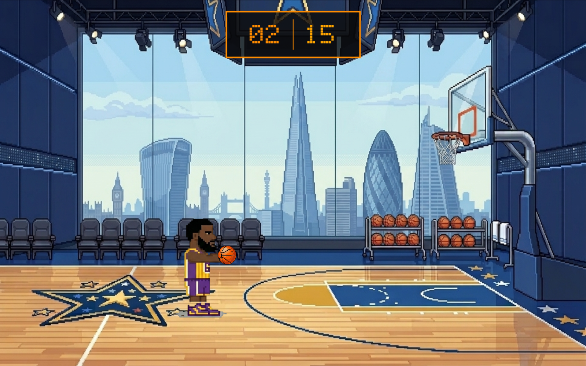

# 🏀 Basket Rush

**Basket Rush** — это динамичная 2D аркадная игра про баскетбол, разработанная на языке **C#** с использованием **Windows Forms**. Основная цель игрока — проявить максимальную меткость и набрать как можно больше очков за ограниченное время. Игра функционирует в полноэкранном режиме, обладает продвинутой физической моделью и стильным неоновым интерфейсом.

## 🛠 Технологический стек

* **Язык программирования:** C#
* **Графическая библиотека:** Windows Forms (GDI+ / System.Drawing)
* **Платформа:** .NET Framework 4.7.2+ / .NET Modern Windows Desktop

## 🏗 Архитектура проекта

Проект спроектирован с использованием строгого архитектурного паттерна **MVC (Model-View-Controller)**:

* **Model (`GameModel.cs`):** Содержит исключительно математические расчеты, координаты объектов, физику гравитации, алгоритмы коллизий, подсчет очков и логику состояний (`GameState`). Не содержит ссылок на UI-компоненты.
* **View (`MainForm.cs`, `MenuUI.cs`, `SettingsUI.cs`):** Отвечает за визуализацию данных, двойную буферизацию (`DoubleBuffered`) для предотвращения мерцания экрана, обработку событий отрисовки `OnPaint` и интерфейс меню.
* **Controller:** Роль контроллера выполняют обработчики событий ввода мыши (`MouseDown`, `MouseMove`, `MouseUp`) и клавиатуры в классе формы, которые транслируют действия пользователя в изменения Модели.
* **Ресурсы (`ResourceManager.cs`):** Статический менеджер кэширования текстур для оптимизации использования оперативной памяти и устранения задержек при загрузке картинок.

## 🚀 Основная концепция и геймплей

* **Ограничение по времени:** На старте раунда игроку дается **15 секунд**. За каждое успешное попадание в кольцо таймер пополняется, что позволяет продлить игру.
* **Система начисления очков и времени:**
  * **Чистый бросок (Swish):** Мяч залетает в кольцо без касания какого-либо объекта: **3 очка** + бонусное время.
  * **Обычный бросок:** Мяч попадает в кольцо после отскока от щита или кольца:  **1 очко** + стандартное время.
* **Динамический спавн:** После каждого попадания игрок случайным образом меняет свою позицию на поле, что требует постоянной корректировки силы и точности броска.

---

## 🕹 Уникальные механики и особенности

### 1. Интуитивное управление броском (Drag-and-Drop)
Сила и направление полета мяча регулируются с помощью мыши. Игрок зажимает мяч и «оттягивает» его назад (по принципу рогатки).

### 2. Визуальный помощник
В момент прицеливания на экране отображается интерактивная пунктирная линия со стрелкой. Она визуализирует расчетную траекторию полета, помогая точнее наводить прицел.

### 3. 2D-физика
Полет рассчитывается по параболе с учетом гравитации. Реализована система обработки коллизий:
* Реалистичный отскок от пола и спортивного щита.
* Столкновение с левым и правым краем кольца с частичной потерей импульса.
* Вращение мяча в полете в зависимости от вектора горизонтальной скорости.

---

## 🗺 Игровой контент и кастомизация

### 🏟 Выбор арен
В игре реализовано **8 уникальных игровых локаций**, каждая из которых обладает собственной атмосферой:
1. Дворовой корт
2. Крыша небоскреба
3. Азиатский турнир
4. Задний двор во Франции
5. Пустыня
6. Ночь в парке
7. Профессиональная арена
8. Пляж

### 🛒 Внутриигровой магазин (Shop)
Интегрированное меню кастомизации позволяет изменять внешний вид прямо перед матчем:
* **Мячи:** Классический, Черный, Серый.
* **Персонажи:** Скины известных баскетболистов (Леброн, Чонси, Джарретт).
